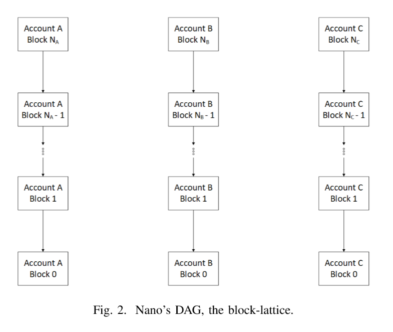
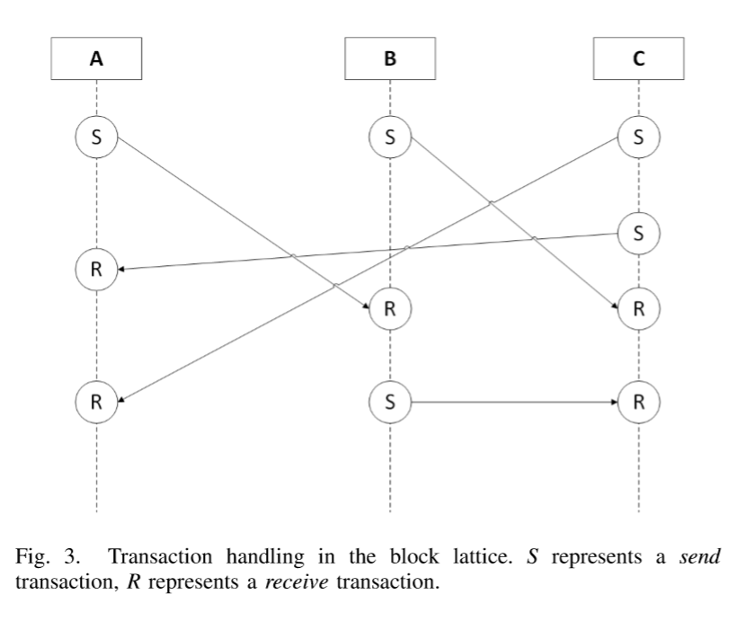

# Distributed Ledger Technology: Blockchain Compared to Directed Acyclic Graph
## Abstract 
现如今，blockchain已经变成分布式账本技术的同义词了。但是，区块链其实仅仅是这个领域的一个分支，虽然现有工作已经深入研究的足够多了，但是往往是从密码学的角度。除了区块链科技，一个新的范式正在冉冉升起：有向无环图。本文的贡献有两个方面。
首先，本文从分布式系统的特点分析了分布式账本技术；第二，本文分析了DAG在分布式账本场景下的使用，并且与基于区块链的解决方法进行了对比。我们用具有代表性的产品如Bitcoin,Ethereum,Nano来对比两个范式。我们从数据结构、共识机制、交易确认、账本大小和伸缩性等方面来对比。

## Introduction
分布式账本技术（之后简称DLT）在一个分布式的环境中通过一个互相不信任的参与者的集合来维护一个全局的、可添加的数据结构。DLT最大的特点就是不可篡改、反监管和去中心化。换句话来说，不需要一个实体来负责解决冲突和保存global truth（这个实体具有绝对权威，而所有的stakeholder都不信任彼此）。DLT适用于追踪数字产品的所属，所以他的最成功的产品就是比特币。DLT有很大的前景，而不只是加密货币。因为账本中的一个entry可以存储任意的数据。然而，在变得可以应用于全球的规模之前，DLT需要解决现在面临的一系列问题。区块链，一个DLT的特例，迎来了一个新对手-DAG。DAG与blockchain最大的差异是区块链打包交易在一条链上，而DAG使用一个图，每个交易作为一个图中的交点。
本文关注它们的分布式设计特点，解释它们怎样攻克了DLT已知的一些问题。我们比较三个具体的实现来做定性分析：Bitcoin、Ethereum是区块链的实现，Nano被用来展示DAG。

## LEDGER DATA STRUCTURES
本部分分析用来支持分布式账本的数据结构。一个账本有他自己的状态。交易导致账本状态的改变，所以DLT可以被视为基于交易的状态机。然而，两个方法使用了截然不同的数据结构。blockchain存储交易在blocks中，DAG存储交易在nodes中。

### A. Blockchain
Blockchain包含了叫做块的有序单元，块包含了头部和交易。每个区块都包含了前个区块的Hash。
交易在比特币和以太坊中使用Merkle Tees来存储，Bitcoin用一个树来hash交易，而Ethereum用三种不同的数据结构来存储transactions,receipts和state。

### Directed Acyclic Graph
对比blocks, DAG每个node代表一个transaction。
在Nano中，每个账户拥有自己的account-chain。

在Nano中，需要两个交易来完成一笔交易。一个发起者生成一个send trasaction,而接收者生成一个对应的receive transaction。

发起交易后，发起者的账户会被扣除金额，但是在网络中pending等待接收者生成对应的接收交易。这个状态被视为
unsettled。receive transaction生成后，状态变为settled。这个方法的缺点是一个节点必须在线接收交易。

## CONSENSUS
在一个public和permissionless的环境中，任意node都可以阅读账本和append to账本。节点和node可以是恶意的，所以我们这里讨论共识算法。
- Blockchain
一条新的交易将会被所有节点验证和接纳。（假设大多数节点是诚实的）。达成共识往往需要一些形式的参与者的投票，比如中本聪设计的共识，每次带运气的选出一个记账者。比特币和以太坊采用的都是POW, 而以太坊宣称要采用POS以后。选出来的记账者然后全网传播他的信息，其他节点同意就把信息加到自己的账本，然后继续寻找后续的entry。
    1. Proof of Work: 在POW中，第一个算出难题的节点赢得了记账权。（POW很熟悉了，这里我不过多介绍。）
    2. Proof of Stake: POW中矿工依赖于算力来赢得机会，而POS中用户下注他们的token来获得机会。以太坊中，POS使用一种名叫Casper的形式来实现。参与者把token下注到智能合约中，有越多的Token, 机会就越大。如果一个incorrect的block被提交了（比如包含double spending的transaction），那么整个参与者的token全部销毁，直接惩罚这个参与者。POS相对于POW有他自己的优点，首先，他消耗的电力更少。基于最近的分析，比特币一年消耗的电力比159个国家还多。第二，相对于POW, 对于POS的攻击更容易惩罚。在POW中，攻击者还是拥有用来攻击的硬件。POS中，burning stake有着销毁攻击者设备的同样影响。

    
- DAG
    在Nano中，不需要选举leader，因为用户有义务去完成他们自己的交易。POW还在用，但是不是用来选举leader。POW被用来防止过度的滥用交易。（prevent over-generation of tx）然而，出现了一种不同的解决冲突的办法: a system of representatives。当一个账户被创建时，他必须选择一个可以随着时间改变的代表。代表为了解决冲突而投票。一个代表的weight是通过计算余额来计算的。在冲突的场景中，winning tx是获得最多投票的tx。

## CONFIDENCE OF TRANSACTION CONFIRMATION
- Blockchain
正如上面所述，POW使用了一个复杂的过程，使得预测leader变得不可能。并且，即使一个entry被加入了账本，也不能保证这个entry就是永远有效的了。这好像跟分布式账本的不可篡改性优点反直觉。确实，有时候一个节点会有两个分支，这叫soft fork。通常我们抛弃一个分支来解决问题...
- DAG
在Nano中，节点可以任意的自由的创造交易。然而还是会发生很多的不一致。举例，两个交易或许会宣称有同样的predecessor,或者一个交易没有被很好的广播，导致该交易之后的交易都被忽视了。当这些情况发生时，representatives就起作用了，他们会来投票解决问题。
值得注意的是，即使一个交易看起来settled了，但是只有当send和receive tx收到大部分的投票时才能确认。除了voting on conflicts, representatives还自动对没见过的blocks投票。一个representative看见一个新的交易，转发它并且附上它的vote-signature如果这个交易时有效的。这意味着网络可以自动传播共识的信息。未来有个特点可能会被加上，block-cementing。

## LEDGER SIZE
每个帐本都会保存从创世区块开始的所有信息，并且账本的大小还在不断增长。随着技术的不断突破，账本大小会增加的更快。比特币已经达到了145GB的数据量，以太坊39GB。这部分我们讨论如何解决账本数据量大的问题。
- Blockchain
比特币客户端提供了pruning mode, 允许用户删除旧的块，只保存小部份的最近的块。优点是磁盘空间节省了。缺点是从这种pruned node中获取不到所有的历史信息。
其他关于Blockchain的size不过多赘述了。

- DAG
Nano有三种节点，historical节点保存了所有数据。current节点保存了head, light节点不需要Hold任何的数据，仅仅可以创造新的交易。
为了减少账本的size, Nano计划实现pruning。因为账户保存账户余额的记录而不是UTXO, 可以丢弃所有的历史数据来减少账本大小。

## SCALABILITY
目前分布式账本最大的问题就是scalability。截止到2018年，比特币网络中还有186951个未处理的交易，以太坊网络中还有22473个未处理的交易。这部分解释两种技术如何应对scalability。

- Blockchain
对区块链来说，交易速率受限于块产生的速率和块的大小。比特币中，大约每十分钟产生一个块，最大的block size为1MB。因此限制了比特币的交易速率在大约3-7TPS。
但是，现有的Visa系统每秒能够处理56000次交易。
潜在的改善scalability的方法是增加区块大小。然而增加区块大小将促使中心化，因为消费级的硬件无法承受这么大的区块。
另一个方法是增加channels, 创造off chain channel来一次性清算交易。
还有如分片等等方法来增加速率。

- DAG
DAG系统的很大不同是不存在矿工，用户自己处理自己的交易，这个方法极大地提升了scalability。这个设计所导致的结果是其实没有内在的限制，然而受限于硬件和网络条件，TPS大约是306左右。

## CONCLUSION
当比较DAG和区块链时，可以总结出DAG存储交易在一个有向无环图中，而区块链存储打包交易到一个个的区块。区块链使用POW、POS等方式选举Leader, 而DAG不用选举LEADER,委派到用户身上，使用representatives来解决冲突。
由于区块链的特性，一笔交易往往需要等待几个区块的确认来最终确认。而在DAG中，大多数投票，一个交易就被确认。
分布式账本的共同问题是ledger size,通常对于磁盘空间和历史数据的保留做tradeoff。

